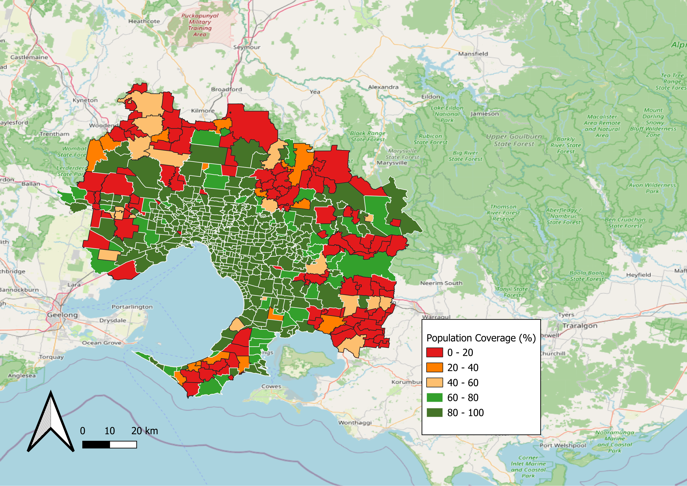
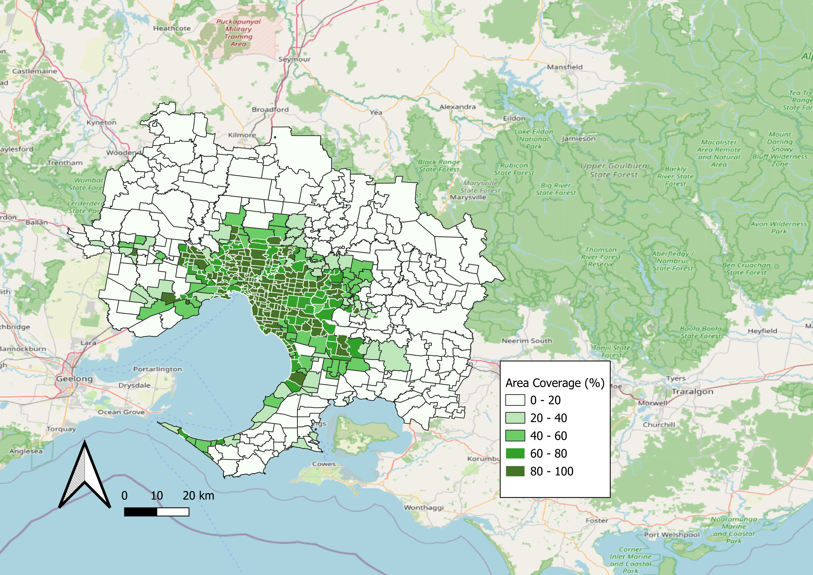

# Public Transport Accessibility Analysis (Greater Melbourne)

## 🔍 Overview
This repository contains a full-stack spatial data engineering and analytics solution developed to evaluate public transport coverage against demographic distributions across the Greater Melbourne Metropolitan area. 

Acting as a Data Analyst for **Public Transport Victoria (PTV)**, this project integrates multi-million row General Transit Feed Specification (GTFS) data from the Mobility Database with geospatial boundary files and national census records from the Australian Bureau of Statistics (ABS). The ultimate goal was to identify critical transport blind spots and assess suburb-level infrastructure scaling.

---

## 🏗️ System Architecture & Data Pipeline

The pipeline was built inside an isolated, containerized environment using **Docker**, passing spatial and relational tables into a local **PostgreSQL / PostGIS** instance. 

```text
[GTFS Transit Data] ---> (DBeaver CSV Engine) --┐
[Census Data (XLSX)] --> (Data Conversion) -----┼--> [PostgreSQL / PostGIS] ---> [Staging Tables &] ---> [QGIS Analytical]
[ABS Meshblocks] ------> (ogr2ogr CLI Engine) --┘     (Containerized Docker)      (Spatial Indexes)        (High-Res Heatmaps)

```
  ---

### 1. Data Restoration & Ingestion Mechanics

* **Spatial Ingestion Engine:** Rather than relying on simple GUI loaders, the project utilized the `ogr2ogr` command-line utility via GDAL to map, multi-polygon promote (`PROMOTE_TO_MULTI`), and programmatically inject complex ESRI Shapefile geometries (`mb2021.shp`) with clean database identifiers directly into the target database schema.
* **Relational Storage:** Relational datasets containing transport frequencies and census distributions were normalized, schema-typed, and bulk-loaded via native database stream copy utilities inside `DBeaver`.

---

## ⚡ Technical Challenges & Performance Engineering

When handling datasets at scale (such as the `ptv.shapes` table containing **over 10.4 million rows** or `ptv.stop_times` tracking **8.2 million transit events**), writing technically correct queries is not enough. Without proper optimization, standard analytical spatial joins across these structures would saturate system memory and require hours to resolve.

To build a production-grade environment, the following engineering choices were implemented:

### 1. Relational & Spatial Index Optimization

To support intensive table joins downstream, selective **B-Tree indexes** were structured on critical primary/foreign key join paths (`trip_id`, `service_id`, and `route_id`). For geometric computing, **GIST (Generalized Search Tree) Spatial Indexes** were placed over geographic column layers to leverage bounding-box spatial filtering.

```sql
-- Performance Tuning Indexes
CREATE INDEX IF NOT EXISTS idx_stop_times_trip ON ptv.stop_times(trip_id);
CREATE INDEX IF NOT EXISTS idx_trips_service ON ptv.trips(service_id);
CREATE INDEX IF NOT EXISTS idx_trips_route ON ptv.trips(route_id);

CREATE INDEX IF NOT EXISTS idx_mb_geom ON ptv.mb2021_full USING GIST (geom);
CREATE INDEX IF NOT EXISTS idx_stops_geom ON ptv.stops_geom USING GIST (geom);

```

### 2. Multi-Stage Query Design (Staging Strategy)

Instead of executing resource-heavy monolithic queries, the calculation architecture was broken up into **13 isolated, sequential staging steps**.

* **The JIT (Just-In-Time) Optimizer Bypass:** PostGIS buffer generation on complex geometries can cause the standard Postgres JIT compiler to over-optimize, wasting massive processing cycles. JIT compilation was explicitly deactivated (`SET jit = off;`) prior to heavy spatial modifications to cut query execution latency.
* **Spatial Join Refinement (`&&` Operator):** When running intersections between residential blocks and 400-meter transit catchment radii (`ST_Intersects`), the index-backed **Bounding Box overlap operator (`&&`)** was evaluated *first* to drop thousands of non-proximal records prior to executing the accurate, computationally expensive geometric calculation.

```sql
-- Example from Staging Step 4: Finding Covered Mesh Blocks
CREATE TABLE ptv.mb_covered AS
SELECT DISTINCT
    mb.MB_CODE21,
    sb.stop_id
FROM ptv.mb_melbourne mb
JOIN ptv.stop_buffers sb
  ON mb.geom && sb.buffer_geom               -- 1st Pass: Fast bounding-box filter
 AND ST_Intersects(mb.geom, sb.buffer_geom); -- 2nd Pass: Precision geometry intersect

```

### 3. Route Signature De-duplication

A major data explosion risk occurred when mapping route types (Tram `0`, Train `2`, Bus `3`). In real-world GTFS tracking, one `route_id` may yield dozens of duplicate short-names. To preserve analytical integrity and satisfy specific transit criteria (e.g., Weekday-only operations), conditional aggregation profiles were built to explicitly count the combination of uniquely matched route names and code signatures per suburb.

```sql
COUNT(DISTINCT CASE WHEN mr.vehicle_type = 'Bus' THEN (mr.route_short_name, mr.route_long_name) END)

```

---

## 📊 Analytical Insights & Spatial Visualizations

The output of the final processing matrix generated a clean, 577-row summary table aggregating **Population Coverage (%)**, **Total Area Coverage (%)**, and **Weekday Route Availability** across every suburb in Greater Melbourne.

---

### 📊 In-Depth Geospatial Analytics & Spatial Signatures

The structural divergence between the **Population Coverage** and **Area Coverage** matrices reveals critical insights into Melbourne's historical transit infrastructure scaling and contemporary urban layout.

---

### 🗺️ 1. Population Coverage Map Analysis
*Measures the exact proportion of a suburb's residential population living within a walkable 400-meter transit catchment.*



#### 🟩 High-Access Geographies (80% – 100% Coverage Matrix)
* **The Continuous Inner-Middle Urban Core:** A dominant high-density catchment extends continuously from inner-northern hubs (Brunswick, Coburg) through eastern transit networks (Richmond, Hawthorn, Box Hill), cascading into the southeastern industrial/residential sandbelt (Brighton, Moorabbin, Dandenong) and western multimodal junctions (Footscray, Sunshine). This continuous signature reflects historical infrastructure density where overlapping tram, bus, and rail networks satisfy the 400-meter proximity threshold for almost the entire population.
* **The Linear Coastal Transit Axis:** A distinct high-coverage linear corridor tracks the eastern shoreline of Port Phillip Bay along the Nepean Highway and Frankston rail line (encompassing Frankston, Mornington, and Mount Martha). 
* **Concentrated Peripheral Pockets (The Portsea-Sorrento Paradox):** Isolated green zones emerge at the southwestern tip of the Mornington Peninsula (Portsea, Sorrento). While geographically remote, their high population coverage reveals a highly localized, linear ribbon-development footprint where residential zoning tightly hugs a single primary road network entirely saturated by transit routes.

#### 🟥 Critical Transit Blind Spots (0% – 20% Coverage Matrix)
* **The Northern Rural-Urban Interface:** Massive low-coverage zones dominate the upper boundaries of the map matrix, representing the peri-urban fringes of the Macedon Ranges (Woodend, Lancefield), northern Mitchell Shire (Wallan), and the forested topographies of Kinglake and Whittlesea. Here, geographic dispersion outpaces transit deployment.
* **Topographic & Agricultural Constraints (Yarra Valley & Dandenong Ranges):** The eastern border displays extensive low-coverage signatures across rural-agricultural expanses (Yarra Junction, Warburton) and the rugged terrain of the Dandenong Ranges. Low population density combined with complex topography makes standard grid-based transit routing economically and logistically unviable.
* **Infrastructure Lag in Western Growth Corridors:** Pronounced service gaps appear across the middle-western peri-urban edge. This spatial signature highlights a classic urban planning challenge: **infrastructure lagging behind rapid residential development** in outer-fringe growth pockets around Melton and Wyndham Vale, where master-planned housing estates exist without established transit connections.

---

### 🗺️ 2. Area Coverage Map Analysis
*Measures the absolute geographic footprint covered by the 400-meter buffers against total administrative polygon boundaries.*



#### 🟩 Hyper-Dense Grid Networks (80% – 100% Geographic Coverage)
* **The Metropolitan Hoddle Grid & Inner Ring:** High area coverage is strictly localized within the Melbourne Central Business District (CBD) and immediate inner-ring suburbs (Carlton, Fitzroy, Collingwood, South Melbourne, Richmond). This signature identifies a hyper-dense, grid-based transit network where overlapping bus, tram, and train buffer zones cover almost every square meter of public and private space.

#### 🟨 Radial Development Corridors (20% – 60% Geographic Coverage)
* **Historic Spatial Footprints:** As the analysis moves into the middle ring, the area coverage transitions into distinct, radiating light-green bands. These paths visually trace Melbourne's historic socioeconomic development corridors—specifically the South-Eastern Corridor (extending toward Clayton and Springvale) and the Eastern Freeway Corridor (Manningham/Whitehorse)—where transit access cleanly follows the arterial road and rail infrastructure skeleton.

#### ⬜ The Administrative Inflation & "Green Wedge" Dilemma (0% – 20% Geographic Coverage)
* **The Peripheral White-Out:** The most striking insight occurs as almost the entire outer metropolitan ring transitions to a low-coverage white signature. This visual phenomenon demonstrates **Administrative Boundary Inflation** interacting with environmental protection laws.
* **The Spatial Insight:** Suburbs like Sunbury (northwest), Healesville (east), or Flinders (southern tip) display exceptionally high *population* coverage because their residents are clustered tightly within localized town centers. However, because their suburb administrative boundaries contain massive, strictly protected **"Green Wedge" environmental zones, national parks, and agricultural farmlands**, the raw *geographic area* covered by 400-meter bus stops drops below 20%. This cleanly highlights that while the people are well-serviced, the vast open geography remains naturally and legally unserved.

---
## 🛠️ Tools, Core Functions & Technologies

* **Database Engine:** PostgreSQL (w/ PostGIS Spatial Extensions) Hosted via Docker
* **Spatial Import Engine:** GDAL `ogr2ogr` (CLI)
* **GIS Mapping Suite:** QGIS (Desktop 3.x)
* **Key PostGIS Methods Utilized:**
* `ST_Buffer(geom::geography, 400)::geometry` — Generates exact metric-distance walkable buffers.
* `ST_Union(geom)` — Dissolves boundaries to create seamless suburb-level shapes.
* `ST_Intersection(geom, geom)` — Extracts precise spatial overlaps between buffers and suburbs.
* `ST_Area(geom::geography)` — Computes accurate surface area metrics in square meters.


---

## 🔗 Links

[PTV Case Study](https://github.com/manavnursmooloo23-maker/portfolio-proj/blob/main/projects/ptv-analysis.md)

```

```
